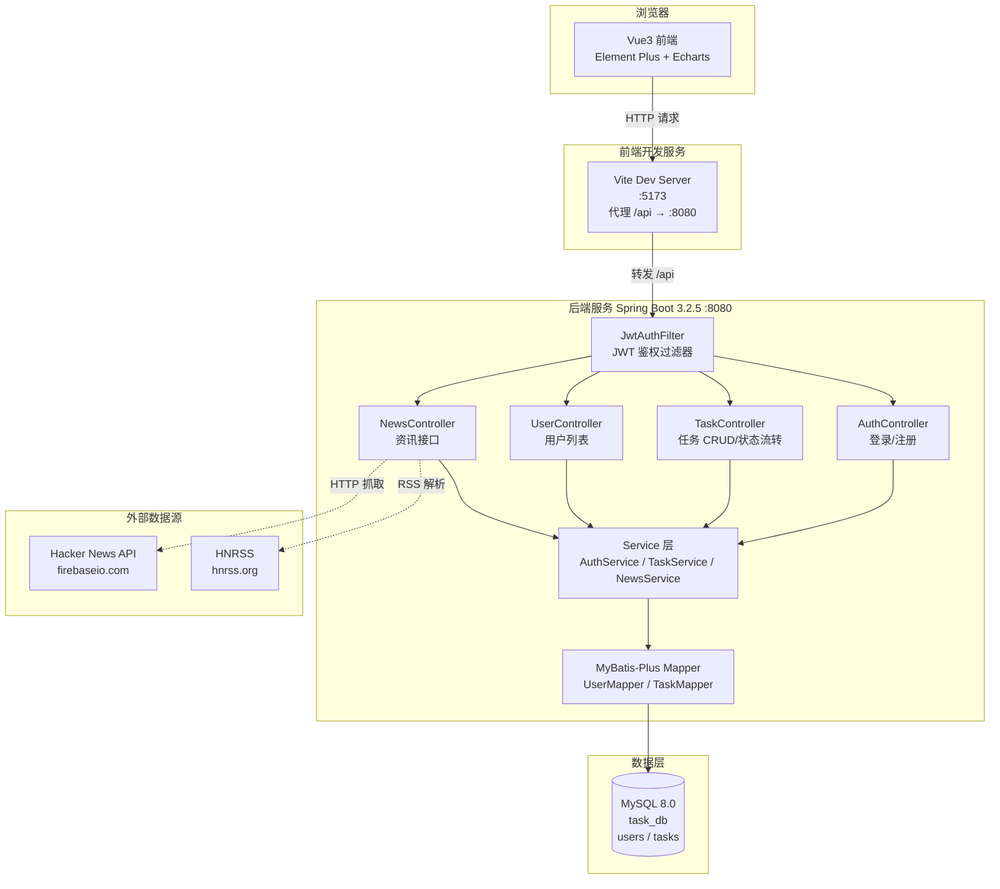
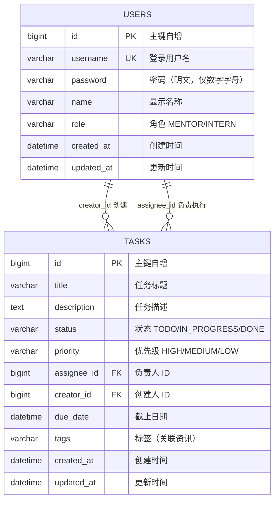

# 内部任务管理系统 - 设计文档

> 实习生与导师任务协作管理系统的设计与实现说明
> 版本：v1.0  |  日期：2026-06-29

---

## 一、系统架构图

系统采用**前后端分离**架构，前端通过 Vite 代理访问后端 RESTful API，后端基于 Spring Boot 提供 JWT 鉴权与业务接口，数据持久化到 MySQL，资讯模块对接外部第三方 API。



**分层职责**：
- **表现层（Controller）**：接收请求、参数校验、返回统一 `Result<T>` 结构
- **业务层（Service）**：任务状态流转、权限控制、资讯抓取与缓存
- **持久层（Mapper）**：MyBatis-Plus + XML 自定义 SQL（多表关联查询）
- **鉴权层（Filter）**：JWT Token 解析，写入 `CurrentUser` 线程上下文

---

## 二、数据库表设计

### 2.1 ER 图



### 2.2 表结构说明

| 表 | 用途 | 关键字段 | 索引 |
|---|---|---|---|
| `users` | 用户（导师/实习生） | `username` 唯一、`role` 区分角色 | `uk_username` 唯一索引 |
| `tasks` | 任务 | `status`/`priority` 枚举、`assignee_id`/`creator_id` 外键 | `idx_assignee`/`idx_status`/`idx_creator` |

**初始数据**：3 个默认账号（`mentor`/`intern01`/`intern02`，密码均 `123456`，由后端 `DataInitializer` 启动时创建）+ 4 条示例任务。

---

## 三、主要 API 接口设计

所有接口统一返回 `{ code, message, data }` 结构，除登录/注册/资讯外均需携带 `Authorization: Bearer <JWT>` 头。

| 方法 | 路径 | 说明 | 鉴权 | 请求参数 / Body |
|---|---|---|---|---|
| POST | `/api/auth/login` | 登录 | 否 | `{ username, password }` |
| POST | `/api/auth/register` | 注册 | 否 | `{ username, password, name, role }` |
| GET | `/api/tasks` | 任务列表（筛选/搜索） | 是 | `?keyword&status&priority&assigneeId&creatorId` |
| GET | `/api/tasks/{id}` | 任务详情（含负责人/创建人姓名） | 是 | path: id |
| POST | `/api/tasks` | 创建任务 | 是 | `{ title, description, status, priority, assigneeId, dueDate, tags }` |
| PUT | `/api/tasks/{id}` | 编辑任务 | 是 | 同创建 |
| PATCH | `/api/tasks/{id}/status` | 状态流转（拖拽/下拉切换） | 是 | `{ status: "TODO/IN_PROGRESS/DONE" }` |
| DELETE | `/api/tasks/{id}` | 删除任务 | 是 | path: id |
| GET | `/api/tasks/dashboard` | 仪表盘统计（按状态分组+完成率） | 是 | 无 |
| GET | `/api/users` | 用户列表（选择负责人） | 是 | 无 |
| GET | `/api/news` | 最新资讯（支持 keyword 搜索） | 否 | `?keyword&size` |
| GET | `/api/news/by-tags` | 按任务标签关联资讯 | 否 | `?tags&size` |

**权限规则**：导师（MENTOR）可查看/操作全部任务；实习生（INTERN）仅能查看分配给自己或自己创建的任务，由 Mapper SQL 中 `viewerRole` 条件控制。

**状态流转**：`TODO → IN_PROGRESS → DONE`，允许回退，由前端看板拖拽触发 `PATCH` 接口。

---

## 四、技术选型理由

| 层 | 技术 | 选型理由 |
|---|---|---|
| 后端框架 | Spring Boot 3.2.5 | 企业级主流框架，自动配置开箱即用，适合 48 小时 MVP 快速交付 |
| ORM | MyBatis-Plus 3.5.6 | 单表 CRUD 自动生成，多表关联可用 XML 灵活编写 SQL，兼顾效率与可控性 |
| 数据库 | MySQL 8.0 | 公司现有环境，关系型数据适合任务-用户关联场景 |
| 鉴权 | JWT (jjwt 0.12.5) | 无状态 Token 适合前后端分离，避免 Session 跨域问题 |
| 前端框架 | Vue 3.4 Composition API | 响应式编程，组合式 API 逻辑复用性强，生态成熟 |
| 构建工具 | Vite 5 | 启动快、HMR 热更新流畅，开发体验佳 |
| UI 组件库 | Element Plus 2.7 | Vue3 生态最完善的组件库，表单/表格/弹窗开箱即用 |
| 图表库 | Echarts 5.5 | 国产开源，文档完善，饼图/柱状图配置简单 |
| 状态管理 | Pinia 2 | Vue3 官方推荐，TypeScript 友好，API 简洁 |
| HTTP 客户端 | Axios | 拦截器机制便于统一处理 Token 与 401 跳转 |

---

## 五、AI 工具使用心得

### 5.1 使用的 AI 工具

| 工具 | 用途 | 使用方式 |
|---|---|---|
| **Trae IDE（Claude 模型）** | 全栈代码生成、调试、Git 推送 | 对话式描述需求，AI 直接读写文件、执行命令、验证联调 |
| **GitHub Copilot**（参考） | 代码补全辅助 | IDE 内行内补全 |

### 5.2 如何验证 AI 生成的代码

1. **编译验证**：后端用 `mvn clean compile` 确保无编译错误（发现并修复了 Hutool API 误用问题，见下文问题 1）。
2. **运行验证**：启动后端服务，用 PowerShell `Invoke-RestMethod` 调用接口验证登录、任务列表返回正确。
3. **数据验证**：用 `mysql.exe` 查询数据库确认表结构、用户密码、任务数据符合预期。
4. **前端联调**：通过 Vite 代理访问后端，验证登录跳转、看板渲染、状态拖拽完整链路。
5. **边界测试**：分别用导师/实习生账号登录，验证权限隔离生效（实习生看不到他人任务）。

### 5.3 遇到的坑与反思

| 坑 | 反思 |
|---|---|
| AI 生成代码时使用了不存在的 API 签名（`XmlUtil.readXML(byte[])`） | 不能盲信 AI，**必须编译+运行验证**，AI 对第三方库版本差异敏感 |
| AI 初版用硬编码 BCrypt 哈希插入用户，导致密码不匹配 | 涉及加密的逻辑应由程序运行时生成，不能硬编码密文 |
| PowerShell 不支持 bash heredoc 语法 | 跨平台脚本要注意 Shell 差异，改用 `git commit -F file` 方案 |
| AI 倾向于过度设计（加 BCrypt、加缓存抽象层） | 需明确约束"只做需求内的事"，遵循 MVP 原则 |

---

## 六、遇到的问题及解决思路

### 问题 1：Hutool `XmlUtil.readXML(byte[])` 编译失败

**现象**：后端编译报错，找不到匹配的方法签名。

```
[ERROR] NewsService.java:[222,31] 对于readXML(byte[]), 找不到合适的方法
    方法 cn.hutool.core.util.XmlUtil.readXML(java.io.File)不适用
      (参数不匹配; byte[]无法转换为java.io.File)
    ...
[ERROR] Failed to execute goal maven-compiler-plugin:compile
```

**原因**：AI 误以为 Hutool 的 `XmlUtil.readXML` 接受 `byte[]` 参数，实际只接受 `File`/`String`/`InputStream`/`Reader`/`InputSource`。

**解决**：将 `byte[]` 包装为 `ByteArrayInputStream`：

```java
// 修改前（编译失败）
Document doc = XmlUtil.readXML(xml.getBytes());

// 修改后（编译通过）
Document doc = XmlUtil.readXML(new java.io.ByteArrayInputStream(
        xml.getBytes(java.nio.charset.StandardCharsets.UTF_8)));
```

---

### 问题 2：PowerShell 管道执行 SQL 导致中文乱码

**现象**：用 `Get-Content schema.sql | mysql ...` 执行 SQL，中文注释和 INSERT 数据变成 `?????`。

```
ERROR 1064 (42000) at line 13: You have an error in your SQL syntax;
near '?????Crypt ?????, name VARCHAR(50) NOT NULL COMMENT '??????'
```

**原因**：PowerShell 管道默认按系统编码（GBK）传输字节流，与 MySQL 期望的 UTF-8 不一致，导致中文乱码并触发 SQL 语法错误。

**解决**：放弃管道，改用 mysql 的 `source` 命令直接读取文件：

```powershell
# 修改前（中文乱码）
Get-Content "schema.sql" -Raw | & mysql.exe -u root -p123456

# 修改后（中文正常）
$env:MYSQL_PWD = "123456"
& mysql.exe -u root --default-character-set=utf8mb4 -e "source d:/hxkj/schema.sql"
```

---

### 问题 3：BCrypt 硬编码密码哈希不匹配

**现象**：初始 SQL 中硬编码的 BCrypt 哈希 `$2a$10$N9qo8uLOickgx2ZMRZoMy...` 与密码 `123456` 不匹配，导致无法登录。

**原因**：AI 从网上拷贝的 BCrypt 哈希并非 `123456` 的加密结果（BCrypt 每次加密盐不同，无法直接复制）。

**解决**：移除 SQL 中的用户数据插入，改由后端 `DataInitializer` 在启动时用 `BCryptPasswordEncoder.encode("123456")` 动态生成正确哈希：

```java
// DataInitializer.java - 启动时动态加密
String encodedPwd = passwordEncoder.encode("123456");
seed("mentor", "张导师", "MENTOR", encodedPwd);
```

后续按用户要求，进一步简化为**明文存储**（移除 BCrypt 依赖，密码字段直接存 `123456`）。

---

### 问题 4：Git push 被拒绝（远程仓库已有内容）

**现象**：首次推送时被拒绝。

```
! [rejected]        main -> main (fetch first)
error: failed to push some refs to 'https://github.com/xierenjie6666/task-management.git'
hint: Updates were rejected because the remote contains work that you do not have locally.
```

**原因**：GitHub 创建仓库时勾选了"Initialize this repository with README"，远程已有一次 Initial commit，与本地无共同祖先。

**解决**：先 `pull --allow-unrelated-histories` 合并无关联历史，解决 README 冲突（保留本地版本），再 push：

```bash
git pull origin main --allow-unrelated-histories --no-edit
git checkout --ours README.md   # 保留本地更完整的 README
git add README.md
git commit --no-edit -m "merge: 合并远程 main"
git push -u origin main         # 推送成功
```

---

### 问题 5：PowerShell 不支持 bash heredoc 语法

**现象**：用 `git commit -m "$(cat <<'EOF' ... EOF)"` 提交多行信息，PowerShell 报一堆语法错误。

```
重定向运算符后面缺少文件规范。
"<" 运算符是为将来使用而保留的。
一元运算符"-"后面缺少表达式。
```

**原因**：`<<` heredoc 是 bash 语法，PowerShell 不支持。

**解决**：将提交信息写入临时文件，用 `git commit -F` 读取：

```powershell
# 写入文件
Set-Content -Path .git\COMMIT_MSG.txt -Value "feat: ..."
# 用 -F 读取
git commit -F .git\COMMIT_MSG.txt
```

---

## 七、总结

本系统在 48 小时内完成 MVP 交付，涵盖用户管理、任务 CRUD、状态流转、筛选搜索、实时资讯、仪表盘统计、权限控制、CSV 导出等完整功能。AI 工具显著提升了开发效率，但**编译验证、运行测试、边界检查**不可或缺——AI 生成的代码约 90% 可直接使用，剩余 10% 需人工介入修复 API 误用、编码问题、跨平台兼容等问题。核心经验是：**把 AI 当作高效助理而非权威，所有产出必须经过验证才能落地**。
